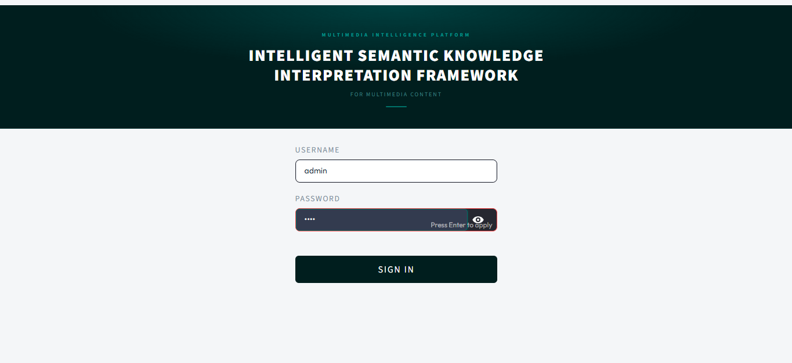
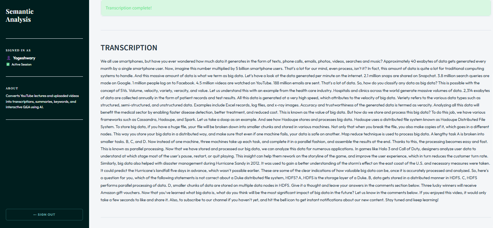
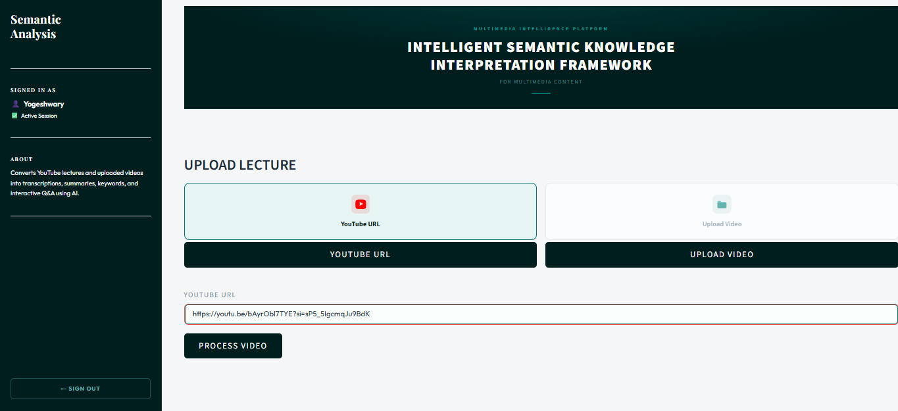
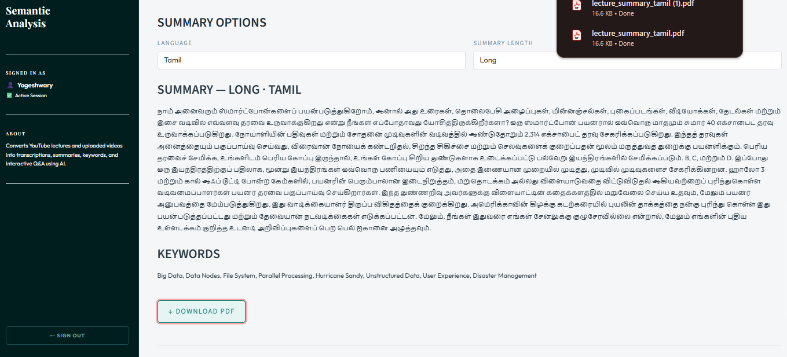
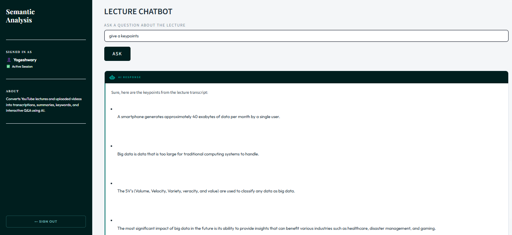

 # 🎯 Multimedia Semantic Knowledge — Streamlit
 
 A Streamlit-based ML web app for analyzing and interpreting multimedia content including text, audio, video, and chatbot interaction.
 
 ---
 
 ## 🚀 Features
 
 - 🎵 **Audio Processing** — Upload audio files and get automatic transcription using Faster-Whisper
 - 🎬 **Video Processing** — Download and extract content from YouTube videos using yt-dlp
 - 📝 **Text Analysis** — Summarization and keyword extraction using NLTK and Scikit-learn
 - 🤖 **Chatbot** — Interactive AI chatbot powered by Ollama
 - 🌐 **Translation** — Translate content to multiple languages using Deep Translator
 - 📄 **PDF Export** — Export summaries and results as PDF using ReportLab
 
 ---
 
 ## 🛠️ Tech Stack
 
 | Category | Technology |
 |---|---|
 | Frontend | Streamlit |
 | Speech-to-Text | Faster-Whisper |
 | NLP | NLTK, Scikit-learn |
 | Chatbot | Ollama |
 | Video Download | yt-dlp |
 | Translation | Deep Translator |
 | PDF Generation | ReportLab |
 
 ---
 
 ## 📸 Screenshots
 






 ## ⚙️ How to Run Locally
 
 **1. Clone the repository**
 ```bash
 git clone https://github.com/Yogeshwary-R/multimedia-semantic-knowledge-streamlit.git
 cd multimedia-semantic-knowledge-streamlit
 ```
 
 **2. Create a virtual environment**
 ```bash
 python -m venv venv
 venv\Scripts\activate  # Windows
 ```
 
 **3. Install dependencies**
 ```bash
 pip install -r requirements.txt
 ```
 
 **4. Run the app**
 ```bash
 streamlit run app.py
 ```
 
 ---
 
 ## 📦 Requirements
 
 ```
 streamlit
 faster-whisper
 nltk
 scikit-learn
 reportlab
 ollama
 yt-dlp
 deep_translator
 ```
 
 ---
 
 ## 👩‍💻 Author
 
 **Yogeshwary R**  
 [GitHub](https://github.com/Yogeshwary-R)
 
 ---
 
 ## 📄 License
 
 This project is open source and available under the [MIT License](LICENSE).
 